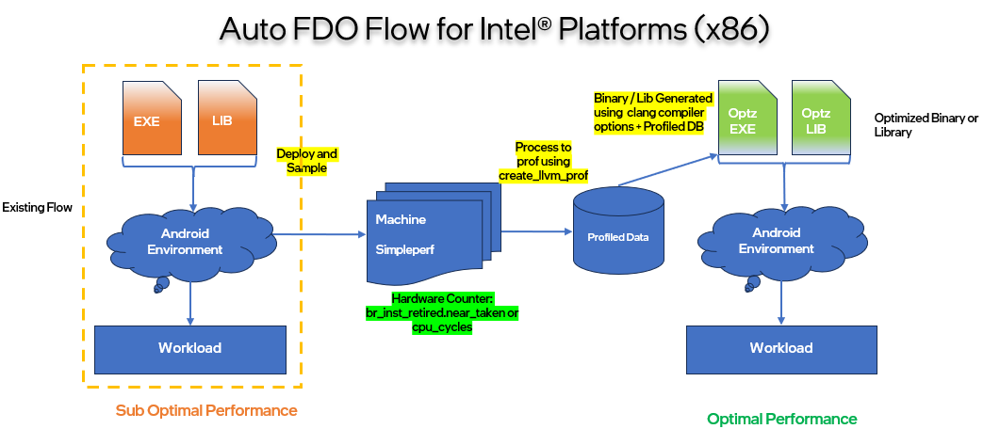

# Collect LBR (x86 Architectures) data for AutoFDO

# Table of Contents

-   Introduction
-   AFDO Compiler Optimizations
    -   Sampling Profiler
    -   Execution Profiles
    -   Limitations of Code Coverage
    -   Generating Sampling Profiles
    -   AFDO Flow Diagram
-   Intel's Performance Monitoring Unit (PMU)
-   Examples
    -   A complete example: autofdo_inline_test.cpp
-   Related docs

## Introduction

The following user guide provides an overview of AFDO compiler
optimizations, details on Intel Performance Monitoring Units (PMU), and
instructions for collecting Last Branch Record (LBR) related profiles on
x86 platforms.

## AFDO Compiler Optimization

**AutoFDO compiler** optimization refer to a set of advanced techniques
employed by compilers to enhance the performance of software
applications. These optimizations are based on insights gained from
hardware performance metrics, specifically focusing on events such as
`br_inst_retired.neartaken` and `cpu_cycles`.

### Sampling Profiler

A sampling profiler can generate a performance profile with very low
runtime overhead. This profile is crucial for optimization purposes but
is not suitable for code coverage analysis. The profiler collects data
by periodically sampling the program's execution, which provides a
statistical representation of where time is being spent in the code.

### Execution Profiles

Compilers utilize **execution profiles** that consist of basic block and
edge frequency counts. These profiles guide various optimizations,
including:

-   **Instruction Scheduling**: Reordering instructions to minimize
    delays and improve pipeline efficiency.
-   **Basic Block Re-ordering**: Rearranging basic blocks to enhance
    cache performance and reduce branch mispredictions.
-   **Function Splitting**: Dividing functions into smaller parts to
    improve inlining and reduce code size.
-   **Register Allocation**: Efficiently assigning variables to CPU
    registers to minimize memory access.

These optimizations aim to improve execution speed, reduce resource
consumption, and enhance the overall efficiency of applications on
specific hardware configurations.

### Limitations for Code Coverage

While it is technically possible to use sampling profiles for code
coverage, they are generally too coarse-grained for this purpose.
Sampling profiles provide a statistical view rather than a precise
execution trace, leading to poor results in code coverage analysis.

### Generating Sampling Profiles

Sampling profiles must be generated by an external tool like simpleperf
in the below case. Once generated, the profile needs to be converted
into a format that can be read by LLVM using create_llvm_prof tool

### AFDO Flow Diagram



## Intel's Performance Monitoring Unit (PMU)

Intel's Performance Monitoring Unit (PMU) is a hardware feature built
into their processors to measure various performance parameters. These
parameters include instruction cycles, cache hits, cache misses, branch
misses, and more. The PMU helps in understanding how effectively code
uses hardware resources and provides insights for optimization.The Last
Branch Record (LBR) is indeed a part of Intel's Performance Monitoring
Unit (PMU). The PMU includes various performance monitoring features,
and LBR is one of them.

The Last Branch Record (LBR) is an advanced CPU feature designed to
meticulously log the source and destination addresses of recently
executed branch instructions. This capability serves as a vital tool for
performance monitoring and debugging, allowing developers to track the
intricate control flow of their programs. By analyzing the data captured
through LBR, we can gain valuable insights into how applications
navigate through their execution paths and pinpoint the areas where the
program spends most of its time-often referred to as "hot paths."

**Branch Statistics**: One of the remarkable applications of LBR is its
ability to gather comprehensive branch statistics in C++ programs. This
data can be pivotal in understanding the behavior of conditional
decisions in the code.

**Virtual Calls**: LBR proves particularly useful for analyzing the
outcomes of indirect branches and virtual calls, key components in
object-oriented programming that can significantly influence
performance.

LBR entries are rich with information, typically consisting of `FROM_IP`
and `TO_IP`, which denote the source and destination addresses of the
branching instructions. This detailed logging offers a clear view of the
program's execution flow.

**Model Specific Registers (MSRs)**: The configuration of LBR relies on
Model Specific Registers (MSRs) specific to Intel CPUs. These registers
play a crucial role in enabling and managing LBR functionalities.
**IA32_DEBUGCTL**: To initiate LBR recording, one must set bit 0 of the
IA32_DEBUGCTL register to 1, effectively activating this powerful
feature. **MSR_LASTBRANCH_x\_FROM_IP**: This particular register is
responsible for storing the originating addresses of the most recent
branch instructions, preserving a trail of execution paths.
**MSR_LASTBRANCH_x\_TO_IP**: Conversely, this register captures the
destination addresses of those most recent branches, creating a
comprehensive map of transitions within the program.

**Clearing LBRs**: A noteworthy aspect of LBR is that it gets cleared
when the CPU enters certain low-power sleep states deeper than C2. To
maintain the integrity of the recorded data, it may be necessary to keep
the CPU in an awake state.

**Stopping LBR**: Ceasing LBR recording can present challenges and might
require invoking performance monitoring interrupts (PMIs), introducing
additional complexity to the management of this feature.

**Advantages**: **Overhead**: One of the standout benefits of LBR is its
minimal overhead; it provides nearly zero performance degradation
compared to traditional software-based branch recording methods, making
it an efficient choice in performance-sensitive applications.
**Accuracy**: Although manual code instrumentation might yield slightly
better precision in certain scenarios, this advantage comes at the
significant cost of increased runtime performance overhead, making LBR a
more appealing alternative in many cases. **Scenarios**: The utility of
LBR shines particularly in situations where the source code is not
readily accessible or when the software builds process remains shrouded
in mystery. In such cases, LBR becomes an invaluable ally in uncovering
insights into program behavior, allowing developers and analysts to make
informed decisions based on the recorded execution paths.

Simpleperf supports collecting LBR data and converting it to input files
for AutoFDO, which can then be used for Feedback Directed Optimization
during compilation.

## Examples

Below are examples collecting LBR data for AutoFDO. It has two steps:
first recording LBR data,second converting LBR data to AutoFDO input
files.

Record LBR data:

``` sh
# preparation: we need to be root the device to record LBR data
# for initial setup
$ adb root
$ adb remount
# device will ask for reboot for changes to be applied
# once initial setup is done,next time onwards the below steps only should be used
$ adb root
$ adb shell
brya:/ \# cd data/local/tmp
brya:/data/local/tmp \#

# Do a system wide collection, it writes output to perf.data.
# If only want LBR data for kernel, use `-e BR_INST_RETIRED.NEAR_TAKEN:k`.
# If only want LBR data for userspace, use `-e BR_INST_RETIRED.NEAR_TAKEN:u`.
# If want LBR data for system wide collection, use `-e BR_INST_RETIRED.NEAR_TAKEN -a`.

brya:/data/local/tmp \# simpleperf record -b -p <processid> -e BR_INST_RETIRED.NEAR_TAKEN:u -c 10003

# if you have a standalone binary the below command needs to be used

brya:/data/local/tmp \# simpleperf record -b -e BR_INST_RETIRED.NEAR_TAKEN:u -c 10003 ./<binaryname>

simpleperf record:
The simpleperf record command is used to profile processes and store the profiling data in a file (usually perf.data).

-b:
This option enables branch recording. It uses the Last Branch Record (LBR) feature of the CPU to capture the
most recent branches taken by the processor. This is useful for understanding the control flow of a program.

-a:
This option tells perf to record system-wide. It collects performance data from all CPUs, not just the one
where the command is run. This is useful for capturing a comprehensive view of system performance.

-e:
This option specifies the event (BR_INST_RETIRED.NEAR_TAKEN in this case) to record.

-c:
This option is used to specify the event count threshold for sampling.


# To reduce file size and time converting to AutoFDO input files, we recommend converting LBR data into an intermediate branch-list format.

brya:/data/local/tmp \# simpleperf inject -i perf.data --output branch-list -o branch_list.data
```

Converting LBR data to AutoFDO input files needs to read binaries. So
for userspace and kernel libraries, it needs to be converted on host,
with vmlinux and kernel modules available.

1) Convert LBR data for userspace libraries:

``` sh
# Injecting LBR data on device. It writes output to perf_inject.data.
# perf_inject.data is a text file, containing branch counts for each library.
# Host simpleperf is in <aosp-top>/aosp/out/host/linux-x86/bin/simpleperf,
# or you can build simpleperf by `make simpleperf_ndk`.

host $ adb pull /data/local/tmp/branch_list.data

host $ simpleperf inject -i branch_list.data --binary <binaryorlibraryname> --symdir <aosp-top>/aosp/out/target/product/generic_x86_64/symbols/system/ -o perf_inject.data
```

2) Convert LBR data for Userspace & kernel:

``` sh
# pull LBR data to host.

host $ adb pull /data/local/tmp/branch_list.data

# download vmlinux and kernel modules to <binary_dir>
# host simpleperf is in <aosp-top>/aosp/out/host/linux-x86/bin/simpleperf,
# or you can build simpleperf by `make simpleperf_ndk`.

host $ simpleperf inject -i branch_list.data --binary <userspacebinaryorlibrary> --symdir <symboldir> -o perf_inject.data
```

The generated perf_inject.data may contain branch info for multiple
binaries. But AutoFDO only accepts one at a time. So we need to split
perf_inject.data. The format of perf_inject.data is below:

\`\`\`perf_inject.data format

executed range with count info for binary1 branch with count info for
binary1 // name for binary1

executed range with count info for binary2 branch with count info for
binary2 // name for binary2

...

    We need to split perf_inject.data, and make sure one file only contains info for one binary.

    Then we can use [AutoFDO](https://github.com/google/autofdo) to create profile. Follow README.md
    in AutoFDO to build create_llvm_prof, then use `create_llvm_prof` to create profiles for clang.

    ```sh
    # perf_inject_binary1.data is split from perf_inject.data, and only contains branch info for binary1.
    host $ create_llvm_prof -profile perf_inject_binary1.data -profiler text -binary path_of_binary1 -out a.afdo -format extbinary

    # perf_inject_kernel.data is split from perf_inject.data, and only contains branch info for [kernel.kallsyms].
    host $ create_llvm_prof -profile perf_inject_kernel.data -profiler text -binary vmlinux -out a.afdo -format extbinary

Then we can use a.prof for AFDO during compilation, via
`-fprofile-sample-use=a.afdo`.
[Here](https://clang.llvm.org/docs/UsersManual.html#using-sampling-profilers)
are more details.

### A complete example: autofdo_inline_test.cpp

`autofdo_inline_test.cpp` is an example to show the complete
process. The source code is in
[autofdo_inline_test.cpp](https://android.googlesource.com/platform/system/extras/+/main/simpleperf/runtest/autofdo_inline_test.cpp).
The build script is in
[Android.bp](https://android.googlesource.com/platform/system/extras/+/main/simpleperf/runtest/Android.bp).
It builds an executable called `autofdo_inline_test`, which runs on device
(Referred here as brya).

**Step 1: Build `autofdo_inline_test` binary**

``` sh
(host) <AOSP>$ source build/envsetup.sh
(host) <AOSP>$ lunch aosp_x86_64-trunk_staging-userdebug
(host) <AOSP>$ make autofdo_inline_test
```

**Step 2: Run `autofdo_inline_test.cpp` on brya, and collect LBR
data for its running**

``` sh
(host) <AOSP>$ adb push out/target/product/generic_x86_64/system/bin/autofdo_inline_test /data/local/tmp
(host) <AOSP>$ adb root
(host) <AOSP>$ adb shell
(brya) / $ cd /data/local/tmp
(brya) /data/local/tmp $ chmod a+x autofdo_inline_test
(brya) /data/local/tmp $ simpleperf record -b -p <processidofautofdobinary> -e BR_INST_RETIRED.NEAR_TAKEN:u
simpleperf I cmd_record.cpp:840] Recorded for 4.0012 seconds. Start post processing.
simpleperf I cmd_record.cpp:941] Samples recorded: 7. Samples lost: 0.
(brya) /data/local/tmp $ simpleperf inject --output branch-list -o branch_list.data
(brya) /data/local/tmp $ simpleperf inject -i branch_list.data
(brya) /data/local/tmp $ exit
(host) <AOSP>$ adb pull /data/local/tmp/perf_inject.data
```

**Step 3: Convert LBR data to AutoFDO profile**

``` sh
# Build simpleperf tool on host.
(host) <AOSP>$ make simpleperf_ndk
(host) <AOSP>$ cat perf_inject.data
2
4160-418d:8
419d-41bb:9
3
4170:1
419d:1
41a7:1
4
4159->4187:3
4185->41d2:1
418d->419d:9
41bb->4160:11
// build_id: 0x1631385c6a846e19fd38cec137041c2200000000
// /data/local/tmp/latest/autofdo_inline_test

(host) <AOSP>$ create_llvm_prof --binary <AOSP>/out/target/product/generic_x86_64/system/bin/autofdo_inline_test  --format extbinary --out autofdo_inline_test.afdo --profile perf_inject.data --profiler text

(host) <AOSP>$ ls -lh autofdo_inline_test.afdo
-rw-rw-rw- 1 root root 1.0K 2025-03-11 10:18 autofdo_inline_test.afdo
```

**Step 4: Use AutoFDO profile to build optimized binary**

``` sh
(host) <AOSP>$ cp autofdo_inline_test.afdo toolchain/pgo-profiles/sampling/
(host) <AOSP>$ vi toolchain/pgo-profiles/sampling/Android.bp
# Edit Android.bp to add a fdo_profile module:
#
# fdo_profile {
#    name: "autofdo_inline_test",
#    profile: "autofdo_inline_test.afdo"
# }
(host) <AOSP>$ vi toolchain/pgo-profiles/sampling/afdo_profiles.mk
# Edit afdo_profiles.mk to add autofdo_inline_test profile mapping:
#
# AFDO_PROFILES += keystore2://toolchain/pgo-profiles/sampling:keystore2 \
#  ...
#  server_configurable_flags://toolchain/pgo-profiles/sampling:server_configurable_flags \
#  autofdo_inline_test://toolchain/pgo-profiles/sampling:autofdo_inline_test
#

(host) <AOSP>$ make autofdo_inline_test
```

We can check if `autofdo_inline_test.afdo` is used when building autofdo_inline_test binary.

``` sh
(host) <AOSP>$ gzip -d out/verbose.log.gz
(host) <AOSP>$ cat out/verbose.log | grep autofdo_inline_test`
   ... -fprofile-sample-use=toolchain/pgo-profiles/sampling/autofdo_inline_test.afdo ...
```

If comparing the disassembly of
`out/target/product/generic_x86_64/system/bin/autofdo_inline_test` before and after
optimizing with AutoFDO data, we can see different preferences in
inlining, branching & basic block re-ordering. In addition we can also
monitor Intel(R) PMU Branch Monitoring events using simpleperf. Refer below events
comparison data.

|Intel(R) PerfMon EventName|Without AFDO|With AFDO|% Delta|
|-|-|-|-|
|BR_INST_RETIRED.ALL_BRANCHES|25289601|25680449|2%|
|BR_MISP_RETIRED.ALL_BRANCHES|2,693,141|2,376,465|-12%|
|BR_MISP_RETIRED.COND|2,477,232|2,133,468|-14%|
|BR_MISP_RETIRED.COND_TAKEN|2,136,117|1,897,894|-11%|
|BR_MISP_RETIRED.INDIRECT|238,063|200,008|-16%|
|BR_MISP_RETIRED.INDIRECT_CALL|205,970|179,661|-13%|
|BR_MISP_RETIRED.RET|76,709|72,147|-6%|
|BACLEARS.ANY|6,217,138|5,761,070|-7%|

|Standard Events|Without AFDO|With AFDO|% Delta|
|-|-|-|-|
|cpu-cycles      |780,810,870|743,257,553|-5%|
|context-switches|7,463|6,659|-11%|
|task-clock      (ms)|187128.967|174391.7821|-7%|

## Related docs

-   [Last Branch Record
    Stack](https://www.intel.com/content/www/us/en/developer/articles/technical/intel-sdm.html)
-   [Performance monitoring events supported by Intel Performance
    Monitoring Units (PMUs)](https://perfmon-events.intel.com/)
-   [AutoFDO tool for converting profile
    data](https://github.com/google/autofdo)
